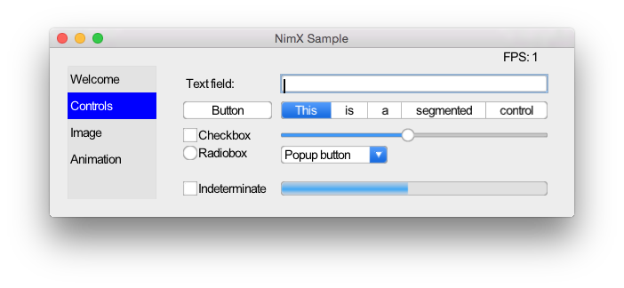

===========
nimx |travis| |semaphore| |nimble|
===========

.. |travis| image:: https://travis-ci.org/yglukhov/nimx.svg?branch=master
    :target: https://travis-ci.org/yglukhov/nimx

.. |semaphore| image:: https://semaphoreci.com/api/v1/projects/24bc2fb0-aebf-4065-a02b-f40ea736a1c6/552519/badge.svg
    :target: https://semaphoreci.com/yglukhov/nimx

.. |nimble| image:: https://raw.githubusercontent.com/yglukhov/nimble-tag/master/nimble_js.png
    :target: https://github.com/yglukhov/nimble-tag

Cross-platform GUI framework in `Nim <https://github.com/nim-lang/nim>`_.

Quick start
===========

Installation
------------
.. code-block:: sh

    nimble install nimx

Please note that nimx is tested only against the latest devel version of Nim compiler.

Usage
------------
.. code-block:: nim

    # File: main.nim
    import nimx.sdl_window
    import nimx.text_field

    # First create a window. Window is the root of view hierarchy.
    # Currently there are two types of windows. SdlWindow should be used
    # with native targets, JSCanvasWindow should be used for WebGL target
    var wnd : SdlWindow
    wnd.new()
    wnd.init(newRect(40, 40, 800, 600))

    # Create a static text field and add it to view hierarchy
    let label = newLabel(newRect(20, 20, 150, 20))
    label.text = "Hello, world!"
    wnd.addSubview(label)

    # Run the main loop
    runUntilQuit()

Running
------------
.. code-block:: sh

    nim c -r --noMain main.nim

Running nimx samples
====================
.. code-block:: sh

    cd $(nimble path nimx)/test
    nake # Build and run on the current platform
    # or
    nake js # Build and run in default web browser

Reference
====================
TODO
