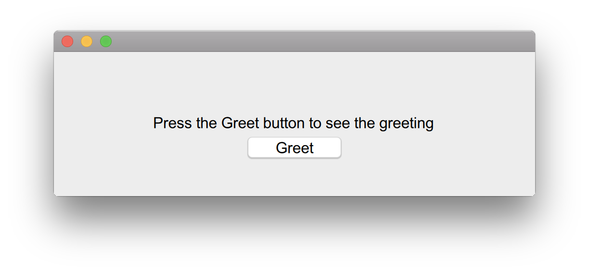

Hello World App
===============

Prerequisites
-------------

Currently nimx uses [SDL2](https://www.libsdl.org/download-2.0.php) for all platforms except web, so make sure SDL2 library is installed and linkable.

Install nimx
------------
Nimx is a regular [nimble](https://github.com/nim-lang/nimble) package so you could either install it or add as a dependecy to your project.
```sh
# If you want to install nimx
nimble install -y nimx

# Or you could add it as your project dependency
echo 'requires "nimx"' >> MYPROJECT.nimble
# And tell nimble to update your project dependencies
nimble install -dy
```

Hello World!
------------

Create a file `helloworld.nim` with the following contents:
```nim
import nimx / [ window, layout, button, text_field ]

runApplication:
    let w = newWindow(newRect(50, 50, 500, 150))
    w.makeLayout: # DSL follows
        - Label as greetingLabel: # Add a view of type Label to the window. Create a local reference to it named greetingLabel.
            center == super # center point of the label should be equal to center point of superview
            width == 300 # width should be 300 points
            height == 15 # well, this should be obvious now
            text: "Press the Greet button to see the greeting" # property "text" should be set to whatever the label should display
        - Button: # Add a view of type Button. We're not referring to it so it's anonymous.
            centerX == super # center horizontally
            top == prev.bottom + 5 # the button should be lower than the label by 5 points
            width == 100
            height == 25
            title: "Greet"
            onAction:
                greetingLabel.text = "Hello, world!"
```

Compile and run:
```sh
nim c -r --threads:on helloworld
```

The application should launch and look like so:

